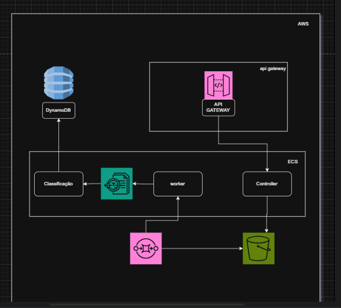
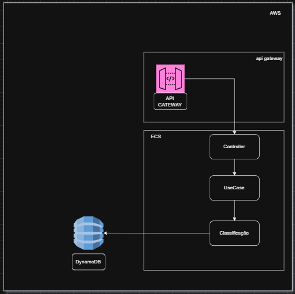
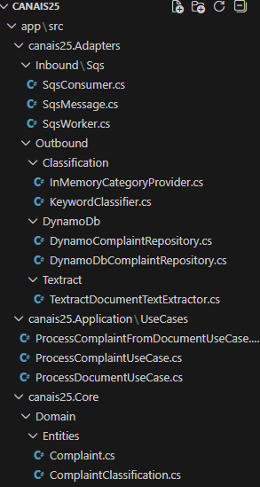
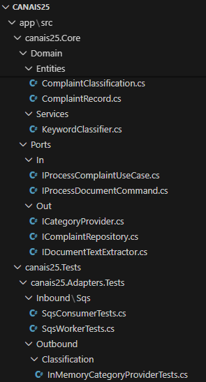
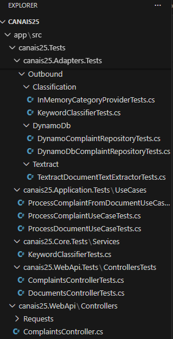
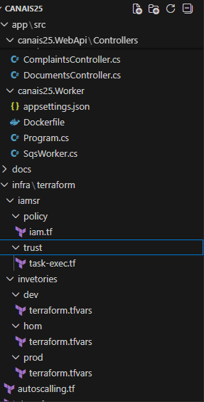
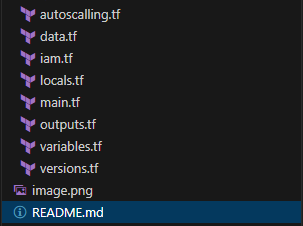

# 📘 CANAIS25 – Documentação do Projeto

## 📌 Visão Geral
O **CANAIS25** é um sistema responsável por receber, interpretar, classificar e armazenar reclamações de clientes provenientes de múltiplos canais, digitais e físicos, garantindo padronização, escalabilidade e baixo acoplamento.

A solução foi construída utilizando **.NET 8**, **Arquitetura Hexagonal (Ports & Adapters)** e serviços gerenciados da **AWS**.

---

## 🎯 Objetivos
- Receber reclamações via **API REST**
- Processar documentos (PDF/imagem) de forma assíncrona
- Extrair texto automaticamente com OCR
- Classificar reclamações por palavras‑chave
- Persistir dados no DynamoDB
- Suportar alto volume com auto scaling

---

## 🧱 Arquitetura
A arquitetura segue o modelo **Hexagonal**, separando:
- **Core**: regras de negócio
- **Application**: casos de uso
- **Adapters**: integrações externas
- **Infra**: AWS via Terraform

```
HTTP / SQS
   ↓
Use Cases
   ↓
Domain
   ↓
Adapters
   ↓
AWS (DynamoDB, Textract, S3)
```

---

## 🔄 Fluxos

### 🟦 Documento (Assíncrono)



### 🟩 Complaint (Síncrono)


---

## 🧠 Classificação
Baseada em palavras‑chave, permitindo múltiplas categorias por reclamação e fácil evolução futura (ML/NLP).

---

## 🧩 Estrutura do Projeto
```
app/src
 ├── canais25.Core
 ├── canais25.Application
 ├── canais25.Adapters
 ├── canais25.WebApi
 ├── canais25.Worker
 └── canais25.Tests
infra/terraform
```





---

## ☁️ Infraestrutura AWS
- ECS Fargate / Fargate Spot
- Application Load Balancer
- SQS + DLQ
- S3
- Textract
- DynamoDB
- IAM
- Auto Scaling

Provisionado com **Terraform**.

---

## 📈 Auto Scaling
Escalonamento automático do ECS Service baseado em CPU e memória.

---

## 🧪 Testes
Testes unitários organizados por camada:
- Core.Tests
- Application.Tests
- Adapters.Tests
- WebApi.Tests

Frameworks:
- xUnit
- Moq
- FluentAssertions

---

## ▶️ Execução Local
```bash
dotnet run --project canais25.WebApi
dotnet run --project canais25.Worker
```

---

## 🚀 Evoluções Futuras
- NLP / Machine Learning
- Dashboards analíticos
- CI/CD 
- Cobertura SAST e DAST 

---

